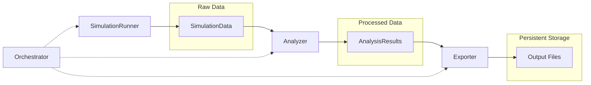

# Clean Architecture: Separation of Concerns

DisruptSC's new architecture follows clean software design principles, implementing a clear **separation of concerns** where each component has a single, well-defined responsibility. This design replaces the previous monolithic executors with a flexible, maintainable, and extensible system.

## Architectural Philosophy

The architecture is built on the **Single Responsibility Principle**: each component does one thing and does it well. This creates a system where components can be developed, tested, and maintained independently while working together seamlessly.

## Core Components

### 1. SimulationRunner 🏃‍♂️
**Pure simulation execution logic**

- **Responsibility**: Execute the actual simulation (time steps, disruptions, model state changes)
- **Input**: Model and parameters
- **Output**: Raw simulation data
- **Does NOT**: Calculate metrics, format output, or decide what data to collect

```python
class DisruptionRunner(SimulationRunner):
    def run(self) -> SimulationData:
        """Execute disruption simulation and return raw data."""
        for t in range(self.parameters.t_final):
            self._apply_disruptions(t)
            self._update_agent_states(t)
            self._collect_timestep_data(t)
        return self.simulation_data
```

**Available Runners:**
- `InitialStateRunner` - Static equilibrium simulations
- `DisruptionRunner` - Disruption scenario simulations  
- `DestructionRunner` - Capital destruction scenarios

### 2. DataCollector 📊
**Structured data gathering during simulation**

- **Responsibility**: Collect agent states, network data, time series at each simulation step
- **Input**: Model state at each time step
- **Output**: Structured SimulationData object
- **Does NOT**: Calculate derived metrics, format for output, or run simulations

```python
class StandardDataCollector(DataCollector):
    def collect_time_step(self, model, time_step: int) -> None:
        """Collect data for a single time step."""
        self._collect_firm_data(model.firms, time_step)
        self._collect_household_data(model.households, time_step)
        self._collect_country_data(model.countries, time_step)
```

**Collection Types:**
- Agent data (firms, households, countries)
- Network states (supply chain, transport)
- Time series data
- Metadata and simulation context

### 3. Analyzer 🔬
**Process raw data into meaningful metrics**

- **Responsibility**: Calculate losses, statistics, derived indicators from simulation data
- **Input**: Raw SimulationData
- **Output**: Processed AnalysisResults with metrics and tables
- **Does NOT**: Run simulations, format files, or collect raw data

```python
class CompositeAnalyzer(Analyzer):
    def analyze(self, data: SimulationData) -> AnalysisResults:
        """Transform raw simulation data into analysis results."""
        results = AnalysisResults()
        
        # Run specialized analyzers
        for analyzer_name, analyzer in self.active_analyzers.items():
            analyzer_results = analyzer.analyze(data)
            results.merge(analyzer_results)
        
        return results
```

**Analyzer Types:**
- `LossAnalyzer` - Calculate economic losses (household, country, sectoral)
- `FlowAnalyzer` - Analyze transport and supply chain flows
- `NetworkAnalyzer` - Network structure and connectivity metrics
- `TimeSeriesAnalyzer` - Temporal patterns and trend analysis
- `CompositeAnalyzer` - Orchestrates multiple specialized analyzers

### 4. Exporter 📁
**Format and output results to files**

- **Responsibility**: Write CSV/JSON files, create summaries, handle file I/O operations
- **Input**: Processed AnalysisResults
- **Output**: Files written to disk
- **Does NOT**: Calculate metrics, run simulations, or collect data

```python
class CompositeExporter(Exporter):
    def export(self, results: AnalysisResults, output_path: Path) -> None:
        """Export analysis results to various file formats."""
        self._export_data_tables(results.export_tables, output_path)
        self._export_summary_files(results.summaries, output_path)
        self._export_network_files(results.network_data, output_path)
```

**Export Formats:**
- CSV tables for data analysis
- JSON files for structured data
- Summary reports
- Network files (GeoJSON, edge lists)

### 5. Orchestrator 🎼
**Coordinate the complete simulation pipeline**

The **Orchestrator** (implemented as `BaseExecutor` and its subclasses) is the conductor of the simulation symphony. It coordinates all components and manages the execution flow without implementing any domain logic itself.

- **Responsibility**: Wire components together, manage execution flow, handle errors
- **Input**: Model and parameters
- **Output**: Complete analysis results
- **Does NOT**: Implement simulation logic, data processing, or file I/O

```python
class DisruptionExecutor(BaseExecutor):
    def execute(self) -> AnalysisResults:
        """Orchestrate the complete simulation pipeline."""
        # 1. Initialize components
        runner = self.create_runner()          # DisruptionRunner
        collector = self.create_collector()    # StandardDataCollector  
        analyzer = self.create_analyzer()      # CompositeAnalyzer
        exporter = self.create_exporter()      # CompositeExporter (optional)
        
        # 2. Execute pipeline
        simulation_data = runner.run()                    # Run simulation
        analysis_results = analyzer.analyze(simulation_data)  # Analyze data
        
        if exporter:
            exporter.export(analysis_results, output_path)   # Export results
            
        return analysis_results
```

**Orchestrator Types:**
- `InitialStateExecutor` - Static equilibrium simulations
- `DisruptionExecutor` - Single disruption scenarios
- `MonteCarloExecutor` - Multiple simulation iterations
- `DestructionExecutor` - Batch destruction analysis
- `CriticalityExecutor` - Infrastructure criticality analysis
- `SensitivityExecutor` - Parameter sensitivity analysis

## Data Flow Architecture



### Data Structures

#### SimulationData
Raw data collected during simulation execution:
```python
@dataclass
class SimulationData:
    firm_data: List[Dict[str, Any]]           # Agent states over time
    household_data: List[Dict[str, Any]]      # Household data 
    country_data: List[Dict[str, Any]]        # Country-level data
    transport_network_data: List[Dict[str, Any]]  # Network states
    time_series: Dict[str, List[Any]]         # Time series metrics
    metadata: Dict[str, Any]                  # Simulation context
```

#### AnalysisResults
Processed results with calculated metrics:
```python
@dataclass  
class AnalysisResults:
    metrics: Dict[str, Any]                   # Calculated metrics by category
    export_tables: Dict[str, pd.DataFrame]   # Data tables ready for export
    time_series_analysis: Dict[str, Any]      # Time series analysis results
    loss_analysis: Optional[Dict[str, Any]]   # Loss calculations
    summaries: Dict[str, Any]                 # Summary statistics
```

## Benefits of Separation

### 🧪 Testability
Each component can be tested in isolation:
```python
# Test runner independently
runner = DisruptionRunner(mock_model, parameters)
sim_data = runner.run()
assert len(sim_data.firm_data) > 0

# Test analyzer independently  
analyzer = LossAnalyzer(parameters)
results = analyzer.analyze(sim_data)
assert 'household_losses' in results.metrics

# Test exporter independently
exporter = CSVExporter()
exporter.export(results, temp_path)
assert temp_path.exists()
```

### 🔄 Reusability
Components can be mixed and matched:
```python
# Same runner with different analyzer
runner = DisruptionRunner(model, parameters)
custom_analyzer = RiskAnalyzer(parameters)

# Same analyzer with different data sources
batch_analyzer = BatchAnalyzer(parameters)
batch_analyzer.analyze(monte_carlo_data)
batch_analyzer.analyze(destruction_data)
```

### 📈 Extensibility
New components can be added without modifying existing code:
```python
# Add custom analyzer
class ClimateRiskAnalyzer(Analyzer):
    def analyze(self, data: SimulationData) -> AnalysisResults:
        # Climate-specific analysis logic
        return climate_results

# Add custom runner
class StochasticRunner(SimulationRunner):
    def run(self) -> SimulationData:
        # Stochastic simulation logic
        return stochastic_data
```

### 🛠️ Maintainability
Changes are isolated to single components:
- **Bug in loss calculation?** → Fix only `LossAnalyzer`
- **New export format?** → Extend only `Exporter`
- **Simulation logic change?** → Modify only `SimulationRunner`
- **Data collection issue?** → Update only `DataCollector`

## Specialized Patterns

### Batch Processing
For complex simulations requiring multiple runs:

```python
class MonteCarloExecutor(BaseExecutor, BatchProcessor):
    def process_batch(self) -> List[AnalysisResults]:
        """Execute multiple simulation iterations."""
        results = []
        for iteration in range(self.parameters.mc_repetitions):
            # Reset model state
            self._reset_model_state()
            
            # Execute single iteration
            iteration_executor = self.base_executor_class(self.model, self.parameters)
            iteration_result = iteration_executor.execute()
            
            results.append(iteration_result)
        return results
```

**Batch Executors:**
- `MonteCarloExecutor` - Multiple random iterations
- `DestructionExecutor` - Multiple destruction scenarios  
- `SensitivityExecutor` - Multiple parameter combinations
- `CriticalityExecutor` - Multiple infrastructure edge tests

### Composite Analysis
Multiple specialized analyzers working together:

```python
class CompositeAnalyzer(Analyzer):
    def __init__(self, parameters):
        # Initialize based on simulation type
        if parameters.simulation_type == 'disruption':
            self.analyzers = {
                'loss': LossAnalyzer(parameters),
                'flow': FlowAnalyzer(parameters), 
                'time_series': TimeSeriesAnalyzer(parameters)
            }
    
    def analyze(self, data: SimulationData) -> AnalysisResults:
        """Run all active analyzers and merge results."""
        combined_results = AnalysisResults()
        
        for analyzer_name, analyzer in self.analyzers.items():
            analyzer_results = analyzer.analyze(data)
            combined_results.merge(analyzer_results)
            
        return combined_results
```

## Usage Patterns

### Standard Simulation Pipeline
The most common usage through the factory:
```python
from disruptsc.run import main

# Create appropriate executor for simulation type
executor = ExecutorFactory.create_executor('disruption', model, parameters)

# Execute complete pipeline (runner → collector → analyzer → exporter)
results = executor.execute()

# Results contain all metrics, tables, and analysis
household_losses = results.get_metric('household', 'losses')
export_tables = results.export_tables
```

### Custom Component Pipeline
For advanced users who need custom behavior:
```python
# Create components individually
runner = DisruptionRunner(model, parameters)
collector = StandardDataCollector(parameters)  
analyzer = CustomRiskAnalyzer(parameters)  # Custom analyzer
exporter = CSVExporter()

# Manual orchestration
sim_data = runner.run()
results = analyzer.analyze(sim_data)
exporter.export(results, output_path)
```

### Mixed Standard/Custom Components
Customize specific parts while using standard components:
```python
executor = DisruptionExecutor(model, parameters)

# Use custom analyzer with standard pipeline
custom_analyzer = ClimateRiskAnalyzer(parameters)
results = executor.execute_with_custom_components(
    analyzer=custom_analyzer
)
```

### Batch Processing
For simulations requiring multiple scenarios:
```python
# Monte Carlo simulation
mc_executor = MonteCarloExecutor(model, parameters, DisruptionExecutor)
batch_results = mc_executor.execute()  # Returns BatchResult

# Access individual iteration results
for iteration, results in batch_results.scenario_results.items():
    iteration_losses = results.get_metric('household', 'losses')
    
# Access aggregated results across iterations
aggregated_results = batch_results.aggregated_results
```

## Factory Pattern

The `ExecutorFactory` provides a simple interface to create the right orchestrator:

```python
class ExecutorFactory:
    @classmethod
    def create_executor(cls, simulation_type: str, model: Model, 
                       parameters: Parameters) -> BaseExecutor:
        """Create appropriate executor for simulation type."""
        
        if simulation_type == "disruption":
            return DisruptionExecutor(model, parameters)
        elif simulation_type == "initial_state":
            return InitialStateExecutor(model, parameters)
        elif simulation_type == "destruction_sectors":
            return DestructionExecutor(model, parameters, target_types="sectors")
        # ... other types
```

**Supported Simulation Types:**
- `initial_state` - Static equilibrium analysis
- `disruption` - Single disruption scenarios
- `destruction_sectors` - Sector-based destruction analysis
- `destruction_provinces` - Geographic destruction analysis
- `criticality` - Infrastructure criticality assessment
- `criticality` - Infrastructure criticality analysis

## Migration from Legacy Architecture

### Before (Monolithic)
```python
# Old approach - everything mixed together
class DisruptionExecutor:
    def execute(self):
        simulation = self.model.run_disruption()        # Simulation
        loss = simulation.calculate_household_loss()     # Analysis  
        simulation.export_times_series(output_folder)   # Export
        return simulation  # Tightly coupled!
```

### After (Clean Architecture)
```python
# New approach - clear separation
class DisruptionExecutor:
    def execute(self):
        sim_data = self.runner.run()              # Simulation only
        results = self.analyzer.analyze(sim_data) # Analysis only  
        self.exporter.export(results, path)       # Export only
        return results  # Clean separation!
```

### Migration Benefits
- **🧪 Testable**: Each component can be unit tested independently
- **🔄 Reusable**: Components work in different combinations
- **📈 Extensible**: Add new functionality without breaking existing code
- **🛠️ Maintainable**: Changes are isolated to specific responsibilities
- **🔍 Debuggable**: Issues can be traced to specific components
- **📚 Readable**: Code structure is self-documenting
- **⚡ Performance**: Components can be optimized independently

## Best Practices

### Component Design
1. **Single Responsibility**: Each component should have one clear purpose
2. **Interface Compliance**: Implement the appropriate abstract base class
3. **Dependency Injection**: Accept dependencies through constructor
4. **Error Handling**: Handle errors gracefully and provide meaningful messages

### Data Flow
1. **Immutable Data**: Don't modify input data; create new output data
2. **Structured Output**: Use defined data structures (`SimulationData`, `AnalysisResults`)
3. **Metadata**: Include context and provenance information
4. **Validation**: Validate inputs and outputs at component boundaries

### Testing Strategy
1. **Unit Tests**: Test each component in isolation with mock dependencies
2. **Integration Tests**: Test component interactions
3. **End-to-End Tests**: Test complete pipelines
4. **Property Tests**: Test invariants and edge cases

### Performance Considerations
1. **Lazy Loading**: Only load data when needed
2. **Memory Management**: Clean up large objects after use
3. **Parallel Processing**: Use batch processing for independent scenarios
4. **Caching**: Cache expensive computations when appropriate

This clean architecture transforms DisruptSC into a flexible, maintainable, and extensible simulation framework where each component has a clear, single purpose. The orchestrator pattern ensures all components work together seamlessly while maintaining their independence.
