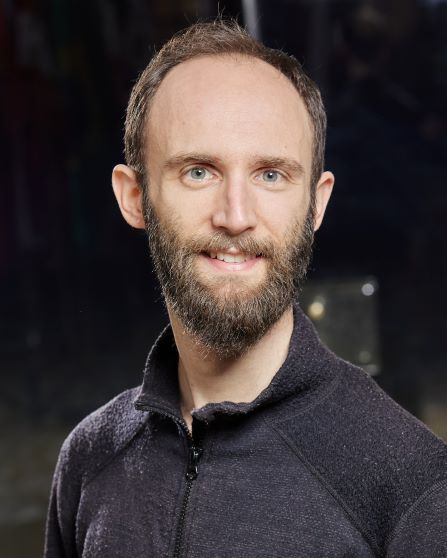

# Contributors

## 🧑‍🔬 Lead Author

  

  

    <strong>Celian Colon</strong>, <a href="https://iiasa.ac.at/">IIASA</a> 
    <a href="https://orcid.org/0000-0002-4132-4648">ORCID</a> 
    <a href="https://scholar.google.com/citations?user=EL2q1fQAAAAJ&hl=en">Google Scholar</a> 
    <a href="https://github.com/ccolon">GitHub</a> 
    celian.colon[at]polytechnique[dot]org
  

## 🤝 Contributors

  

  

    <strong>Stephane Hallegatte</strong>, <a href="https://www.worldbank.org/">World Bank</a> 
    <a href="https://www.worldbank.org/en/about/people/s/stephane-hallegatte">Home Page</a> 
    <a href="https://scholar.google.fr/citations?user=7xxEWRkAAAAJ&hl=en">Google Scholar</a> 
  

####

  

  

    <strong>Julie Rozenberg</strong>, <a href="https://www.worldbank.org/">World Bank</a> 
    <a href="https://scholar.google.fr/citations?user=ifJDfAIAAAAJ&hl=en">Google Scholar</a> 
  

####

  

  

    <strong>Davide Luzzati</strong>, <a href="https://www.ifc.org/en/home">IFC</a> 
    <a href="https://scholar.google.fr/citations?user=pRW8sOEAAAAJ&hl=en">Google Scholar</a> 
  

####

  

  

    <strong>Adrien Fauste-Gay</strong>, <a href="https://www.centre-cired.fr/en/home/">CIRED</a> & <a href="https://www.isterre.fr/">ISTerre</a> 
    <a href="https://adrienfaustegay.github.io/index.html">Website</a> 
  

####

  

  

    <strong>Elisa Nobile</strong>, <a href="https://www.iusspavia.it/en">IUSS Pavia</a> & <a href="https://iiasa.ac.at/">IIASA</a> 
    <a href="https://www.phd-sdc.it/research/interdisciplinary-research-and-austrian-adventures-a-phd-journey-at-iiasa">Webpage</a> 
  

## 🏛️ Funders

    

