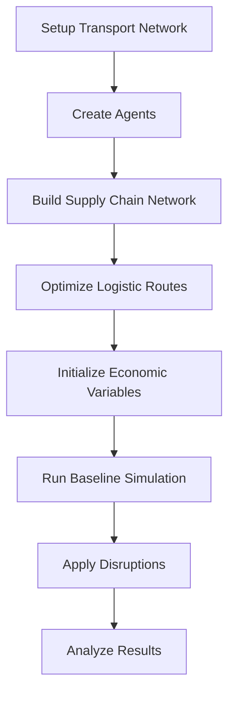

# DisruptSC

[](https://github.com/ccolon/disrupt-sc/releases/tag/v{{ version }})

**Version {{ version }}**

DisruptSC is a **spatial agent-based model** for simulating supply chain disruptions. It models economic agents (firms, households, countries) connected through transport networks and supply chains to analyze the impact of disruptions on economic systems.

## Key Features

🌍 **Spatial Modeling**
:   Agents are located on transport networks with realistic geographic constraints

🏭 **Multi-Agent System**
:   Firms, households, and countries with distinct behaviors and interactions

🚛 **Transport Networks**
:   Multiple transport modes (roads, maritime, railways, airways, pipelines)

💼 **Economic Foundations**
:   Based on Multi-Regional Input-Output (MRIO) tables

⚡ **Disruption Analysis**
:   Model transport disruptions and capital destruction events

📊 **Rich Outputs**
:   Detailed economic and spatial results for policy analysis

## Quick Start

!!! tip "New to DisruptSC?"
    
    Start with our [Installation Guide](getting-started/installation.md) and then try the [Quick Start Tutorial](getting-started/quick-start.md).

```bash
# Clone repo
git clone https://github.com/ccolon/disrupt-sc.git
cd disrupt-sc

# Install dependencies
conda env create -f dsc-environment.yml
conda activate dsc

# Set up data
# Optional full-data setup: clone the private data repo next to this repo
cd ..
git clone <data-repo-url> disrupt-sc-data
cd disrupt-sc

# Alternative custom location:
# export DISRUPT_SC_DATA_PATH=/path/to/disrupt-sc-data

# Without private data, the bundled examples/data/Testkistan dataset is available.

# Validate inputs
validate-inputs Testkistan

# Run a simulation
disruptsc Testkistan
```

## Use Cases

**🏛️ Policy Analysis**
:   Assess economic impacts of infrastructure disruptions for policy planning

**🌪️ Disaster Response**
:   Model supply chain vulnerabilities during natural disasters

**🚧 Infrastructure Planning**
:   Evaluate critical transport links and redundancy needs

## Model Workflow



## Architecture Overview

DisruptSC uses a modular architecture with clear separation of concerns:

- **[Agents](architecture/index.md)**: Economic actors with spatial locations and behaviors
- **[Networks](architecture/index.md)**: Transport infrastructure and supply chain relationships
- **[Disruptions](architecture/index.md#disruptions-and-recovery)**: Events that affect agent capabilities or network availability
- **[Simulation](architecture/index.md#the-time-step)**: Time-stepped execution with data collection

---

## Getting Help

📖 **Documentation**
:   Comprehensive guides and API reference in this documentation

🐛 **Issues**
:   Report bugs and request features on [GitHub Issues](https://github.com/worldbank/disrupt-sc/issues)

💬 **Discussions**
:   Contact the [lead author](contributors/index.md) directly

---

## Citation

If you use DisruptSC in your research, please cite:

### 📚 APA Style

Colon, C., Hallegatte, S., & Rozenberg, J. (2021). Criticality analysis of a country’s transport network via an agent-based supply chain model. Nature Sustainability, 4(3), 209-215.


### 🔖 BibTeX

```bibtex
@article{colon2021disruptsc,
  author  = {Celian Colon and Stephane Hallegatte and Julie Rozenberg},
  title   = {Criticality analysis of a country’s transport network via an agent-based supply chain model},
  journal = {Nature Sustainability},
  volume  = {4},
  pages   = {209--215},
  year    = {2021},
  doi     = {10.1038/s41893-020-00649-4},
  url     = {https://www.nature.com/articles/s41893-020-00649-4}
}
```
```bibtex
@software{disruptsc2025,
  title={DisruptSC: Spatial Agent-Based Model for Supply Chain Disruption Analysis},
  author={Celian Colon},
  year={2025},
  url={https://github.com/ccolon/disrupt-sc}
}
```

## License

DisruptSC is released under the [MIT License](https://github.com/worldbank/disrupt-sc/blob/main/LICENSE).
