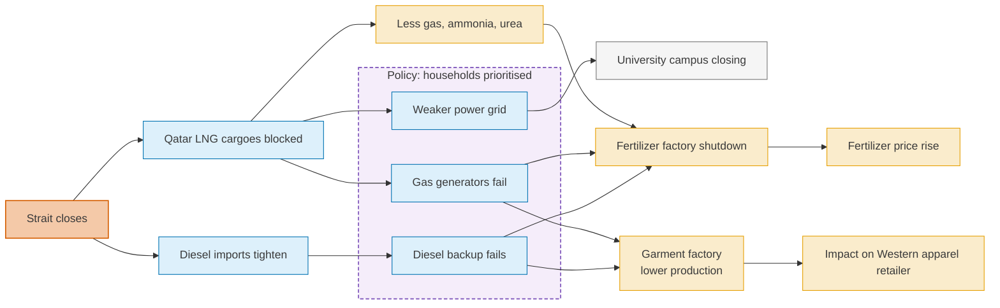
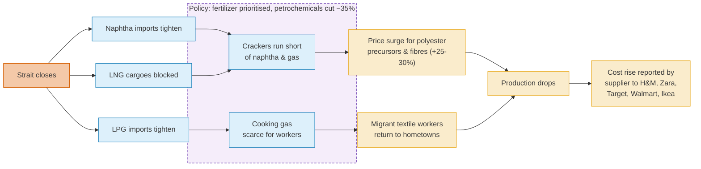
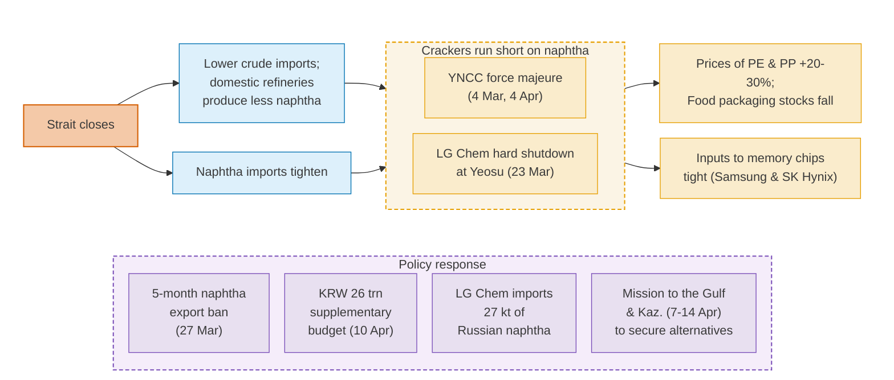
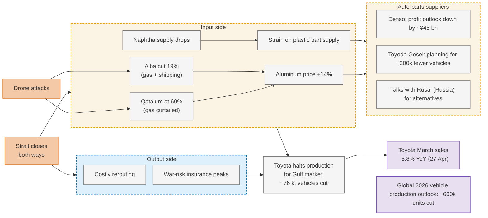
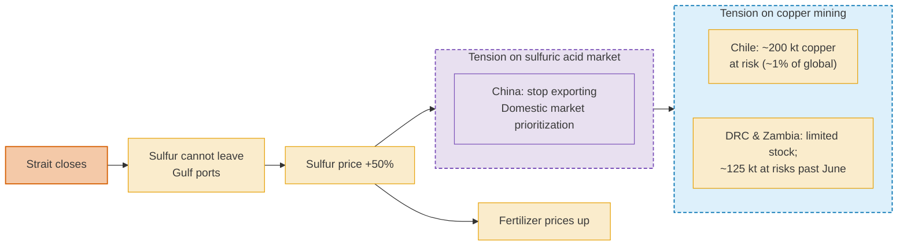

# Strait of Hormuz Closure Beyond Oil

## Five Cases of Supply Chain Disruptions

*[Célian Colon](mailto:celian.colon@polytechnique.org), International Institute for Applied Systems Analysis (IIASA) — updated 29 April 2026*

!!! note "Brief 2 of the [Hormuz Crisis Analytics](index.md)"
    This brief is the empirical companion to [Brief 1 — Logistics Disruption & Supply-Chain Spillovers](supply-chains.md) (21 April). It has **not** yet been peer-reviewed. The case-study material is drawn from independent trade-press and industry reporting; there are no model outputs.

[:material-file-pdf-box: **Download full brief (PDF)**](assets/CC_Hormuz_CaseStudies.pdf){ .md-button .md-button--primary }

---

## Key findings

- We document **five cases of supply-chain disruptions**, all starting in Hormuz: Bangladeshi fertilizer, textile, and universities; Indian polyester apparel; Korean petrochemicals and electronics; Japanese car manufacturing; and Chinese sulfuric acid and global copper mining.
- They reveal **multiple pathways** along which the Strait closure disrupts supply chains.
- Disruptions propagate **downstream** from the Gulf to Asian manufacturing, via energy (gas and diesel) and raw material supply (naphtha, aluminum, sulfur). They also propagate **upstream**: shipping cars to the Gulf is now costly, so Japanese carmakers are curtailing production, which impacts their own suppliers.
- **Toyota is the first global company whose sales decline (−5.8% year-on-year in March) has been publicly linked to Hormuz** by Bloomberg, Nikkei, and others.
- **Policy responses are key modulators.** India prioritizes gas for fertilizer over textiles; Korea bans naphtha exports and sources it from Russia — for the first time since 2022; China halts sulfuric acid exports.
- By prioritizing some over others, **policy responses tend to propagate disruption further**: Chilean and African copper mining is now at risk after China's decision.
- **Take-away message:** coordinated responses across industries and geographies are essential to avoid the coming bulk of economic losses.

---

## Introduction

Last week, I published a [model-based prediction](supply-chains.md): the closure of the Strait of Hormuz has economic consequences beyond a pure oil-price effect. It triggers supply chain disruptions that propagate and intensify over time as inventories are depleted. Now, I want to examine **what is really happening across industries worldwide**. With the help of AI agents, I have scanned the web, resulting in about 150 news items, mostly from specialized press.

**Five case studies surfaced.** They show **supply chain disruptions** — gas in Bangladeshi industrial zones, naphtha for Korean petrochemistry, sulfuric acid for Chilean copper mines, logistics constraints preventing car deliveries — that no oil-price-only model would capture.

This is not a quantitative assessment, but an attempt to understand how, **concretely**, supply chain disruptions are propagating. This brief reports the cases and summarizes the lessons learned. A follow-up will combine these findings with new model runs to quantify aggregate impact.

---

## Case 1 — Bangladesh: Qatar LNG, fertilizer, and garments

When QatarEnergy declared *force majeure*[^1] on long-term LNG contracts on 3 March 2026, only four of the nine ships expected for March had made it across the Strait. Gas pressure in industrial clusters quickly fell fivefold to tenfold, with overall supply reportedly dropping by 10% between February and April.

Gas is used at two points of the Bangladeshi fertilizer production: (i) power generation, and (ii) feedstock for nitrogen and phosphate fertilizer production. Natural gas is converted into ammonia, then into urea, or combined with phosphoric acid to form diammonium phosphate (DAP). As a consequence of the gas pressure drop, four of five major urea plants were shut by 5 March; by 3 April, only one (Ghorshal-Polash) was operating. On 18 April, the country's only DAP factory halted production because the on-site ammonia stockpile ran out.

On the apparel side, garment factories — concentrated in the Gazipur and Ashulia clusters in Dhaka, collectively representing roughly 40 bUSD/year of exports — lost their three energy lifelines at once: power grid, piped gas for captive generation, and diesel for backstop generators (the diesel itself constrained by Hormuz disruption). The industry association reported a 20–30% output loss and raised the issue formally with the Power and Energy ministers on 13 April. As for Western apparel retailers, reports mention precautionary order cuts.

Power grid difficulties have also led authorities to shut down some facilities on university campuses.

*Bangladesh cascade: Hormuz closure propagates through gas and diesel supply to the fertilizer and garment industries. Source: author's synthesis based on trade-press reporting.*

---

## Case 2 — India: Gulf gas, naphtha, and the polyester apparel chain

The Gulf supplies most of India's *naphtha*[^2] and a substantial share of its LNG, including cooking gas. After the closure, the Indian government invoked the Natural Gas Control Order, redirecting oil and gas to high-priority sectors, including fertilizer production. As of 15 April, the Ministry confirmed LNG supply to refineries and petrochemical units would be consequently cut by 35%.

*Polyester* is an important petrochemical product and a key input to the textile industry. It is synthesized from both naphtha and natural gas, which are cracked, purified, and polymerized into polyester staple fiber, which is spun into yarn and woven into fabric in industrial clusters such as Surat, in Gujarat.

As a consequence of restrictions on naphtha and LNG, polyester prices rose sharply, prompting factories to reduce production. At Radheshyam Textile, for instance, half of the 200 polyester looms have been silent since the conflict began, with daily output down 60–65%; dyeing and printing units have moved from one to two non-operating days per week.

Supply chain disruptions do not only propagate via material inputs but also via labor. Internal migrant workers of textile factories have reportedly been hit by a cooking gas shortage. This lack of basic cooking capacity led many of them to return to their hometowns, effectively reducing the factories' labor force.

This situation is cascading to Western brands. The chief executive of a Surat-based dyed-and-printed polyester supplier (Bindal Silk Mills) to H&M, Inditex (Zara), Target, Walmart, and Ikea confirmed to Reuters that costs have "drastically" risen.

*Indian cascade: Hormuz closure propagates through naphtha and gas supply to the polyester petrochemical industry, then to the textile industry. Policies have explicitly favored LNG supply for fertilizer production over petrochemical production. Source: author's synthesis based on trade-press reporting.*

---

## Case 3 — Korea: from naphtha to consumer goods and AI chips

Beyond textiles, naphtha is also the primary feedstock, via its cracking into ethylene and propylene, for the resins used in packaging films, PET bottles, and a wide range of plastic parts. In Korea, naphtha arrives by two routes, both ultimately Gulf-dependent. Roughly 45% is imported directly as finished naphtha, of which about 77% comes from the Gulf. The remainder is refined at home from imported crude, most of which is also Gulf-sourced.

On 4 March, Korea's third-largest ethylene producer (Yeochun NCC) announced a *force majeure*. Other producers, LG Chem and Lotte Chemical, issued similar warnings; on 23 March, LG Chem shut down an 800,000-t/y cracker at Yeosu. On 4 April, Yeochun NCC issued a second *force majeure*, indicating the disruption was renewing rather than easing.

Thirteen industry organizations reported procurement disruptions in vinyl, film, and PET containers, with inventory for some items falling to roughly two weeks. Korean memory chipmakers, especially Samsung and SK Hynix, have been flagged as exposed: a specialized stream of naphtha-derived chemistry feeds the photoresist materials used in semiconductor lithography. Both companies hold roughly 70% of the global DRAM market and 80% of the high-bandwidth memory market, the latter used in Nvidia's artificial intelligence chips.

To protect this highly critical industry, the Korean government imposed a five-month statutory ban on naphtha exports on 27 March. It included mandatory daily reporting, and the authorities are directly controlling supply to the consuming sectors.

A supplementary budget of around KRW 26 trillion (~$17 bn) was passed on 10 April, including naphtha-import subsidies and stockpile purchases from non-Gulf suppliers. LG Chem imported 27,000 tonnes of Russian naphtha — notable given Korea's previous alignment with Western sanctions toward Russia — explicitly framed as protection for the chip-input stream. Korea's Presidential Chief of Staff toured Saudi Arabia, Kazakhstan, Oman, and Qatar in April. The mission secured commitments for 273 million barrels of crude and 2.1 million tonnes of naphtha by year-end, routed through non-Hormuz supply lines — including Saudi shipments via the Red Sea port of Yanbu.

*Korean cascade: Hormuz closure propagates through naphtha to the large Korean petrochemical industry. Multiple consumer goods are under tension, including PET packaging and electronic chips. Active policy responses to protect the domestic industry. Source: author's synthesis based on trade-press reporting.*

---

## Case 4 — Japan: bidirectional shock to the auto sector

The Strait closure affects ships in both directions. We tend to focus on outbound cargoes leaving the Gulf, but inbound flows are equally disrupted. Japan's auto sector is hit on both sides.

On the input side, Japanese carmakers and their suppliers source roughly 70% of their processed aluminum and naphtha from the Gulf—aluminum for body panels and powertrain components, naphtha-derived plastics for interiors and electronics. The Gulf aluminum smelters (8–9% of global production) benefit from abundant natural gas. Qatar Aluminium scaled back to 60% capacity from 12 March after drone strikes hit its gas supply. Aluminium Bahrain cut 19% of capacity on 15 March amid gas uncertainty and shipping disruption. Consequently, global aluminum prices rose by 14%.

Several Japanese auto-parts suppliers (Tier-1 and Tier-2 firms feeding Toyota, Honda, and Nissan) opened negotiations in early March with Russia's Rusal, the world's second-largest aluminum producer, with no deal publicly announced yet. As in the Korean case, it constitutes a notable pivot: Japanese firms had voluntarily halted Russian aluminum purchases since February 2022.

On the output side, Japanese car manufacturers dominate the Gulf car market. With the Strait blocked, those companies have trouble reaching their consumers: rerouting is costly, and war-risk insurance premiums have soared. Toyota halted production of Gulf-bound vehicles: roughly 20,000 units in March, 18,000 in April, and a further 38,000 in total, according to an announcement on 21 April. The cumulative figure approaches 76,000 vehicles.

Both disruption pathways—input and output—converged on 27 April: Bloomberg, Nikkei, and others connected Toyota's 5.8% year-on-year drop in March 2026 global sales to the Hormuz crisis—the first time a global company's sales decline has been publicly tied to the conflict. The pressure is showing up at suppliers: Denso has cut its profit outlook by ~¥45 bn, and Toyoda Gosei is planning for ~200k fewer vehicles than ordered. Commodities research firm CRU has cut its 2026 global light vehicle production forecast by 600k+ units.

*Japanese cascade: Hormuz closure propagates on both sides of Japanese car manufacturers. On the input side, they face tensions in aluminum markets due to the Strait closure and drone attacks on Gulf facilities. On the output side, they cannot ship vehicles to the Gulf market. Source: author's synthesis based on trade-press reporting.*

---

## Case 5 — Gulf sulfur, Chinese sulfuric acid, and global copper production

This is the longest cascade in geographical reach. The Gulf supplies roughly half of all internationally traded *sulfur* shipped by sea, a by-product of their refineries and gas-processing plants. Sulfur is the upstream input to *sulfuric acid*, which is used to extract *copper* from oxide ores. Copper is essential to electric and electronic equipment and infrastructure, and is widely considered a material bottleneck for the energy transition.

With Hormuz closed, sulfur could no longer be shipped out to fertilizer and chemical buyers worldwide. The benchmark sulfur price rose around 50%, reaching $630 per tonne by April. Beyond tensions in the fertilizer markets, this price surge impacted the sulfuric-acid-copper value chain. China, the world's largest exporter of sulfuric acid, responded by prioritizing domestic users, shipping none to Chile in March 2026. On 10 April, China announced it would halt sulfuric acid exports from 1 May.

As a consequence, around 200,000 tonnes of Chilean copper production are reported at risk, equivalent to about 1% of global supply. According to the financial press, BHP, one of the world's largest miners, has reportedly shifted its copper supply outlook toward its African operations and away from Chile. In parallel, the Democratic Republic of the Congo and Zambia, which together import about 2 Mt of sulfur annually for their copper mines, are reported to hold two to three months of inventory; if the squeeze persists past June, around 125,000 tonnes of copper output could be at risk.

*Mining cascade: Hormuz closure halts Gulf sulfur exports, driving up fertilizer prices and tensions in the sulfuric acid markets. China halts exports of this acid, affecting copper extraction in Chile and Africa. Source: author's synthesis based on trade-press reporting.*

---

## What we have learned

**Timing and coverage**

- The set of affected industries is large. It is not only energy and fertilizers, but also plastic manufacturing, textiles, mining, carmaking, all the way to electronics and AI chips.
- As expected, South Asia is the most affected region, but the impact is cascading further East to China, Korea, and Japan, and is starting to ripple to other regions (South America, Africa, Europe).
- Force majeure declarations and price moves dominated the first few weeks. Since late March, production reduction and sales loss have been kicking in.

**Propagation along supply chains**

- Downstream propagation — from raw materials to manufacturing — operates through three channels: energy supply (gas-powered heavy industry), raw inputs (naphtha, aluminum, sulfur), and labor (workers unable to work when cooking gas is rationed).
- Upstream propagation — from clients to their suppliers — is also occurring. Car manufacturers reduce their production for Gulf countries, which ripples to their own suppliers.

**Policy responses**

- Policy responses (India's gas allocation, Korea's naphtha export ban, China's sulfuric-acid export halt) are key modulators of the cascade.
- But by prioritizing some sectors over others, they create ripple effects that propagate disruptions further.
- This implies that **international coordination, not just national emergency responses, will be critical** for managing the coming weeks of closure and potential recovery.

## Limitations

- This brief synthesizes secondary reporting, not primary data. I have focused on **trustworthy sources**, including trade and commodity press, giving higher weight to recognized sources such as Reuters. Yet, I did not engage directly with industry representatives to confirm all information.
- The last step in the disruption cascades is often **a warning** rather than an effective disruption. In Korea, photoresist-grade plastics have been flagged as tight, but no fab-level outages at Samsung or SK Hynix have been reported. Copper production in Chile and Africa is at risk, but we have not yet observed output losses.
- Several cases carry non-Hormuz stressors, which act as **confounding factors**. The Indian textile industry is hit by US tariffs, which impact sales. Toyota sales decline may also be due, in part, to a non-Hormuz factor: a separate, planned production slowdown linked to a model upgrade. Chinese sulfuric acid exports may not be entirely driven by Hormuz; they may also reflect other policy priorities.
- The five cases were chosen for the depth and quality of their documentation, **not as a representative sample** of global disruption. They illustrate cascade mechanisms but cannot quantify how widespread or how severe the broader impact has been; many other cascades are unfolding in parallel that this brief does not cover.

---

## Sources

I report only the most salient URLs per case.

??? abstract "Bangladesh"
    - [Why QatarEnergy's LNG production halt could shake up global gas markets — Al Jazeera](https://www.aljazeera.com/economy/2026/3/2/why-qatarenergys-lng-production-halt-could-shake-up-global-gas-markets)
    - [Middle East crisis disrupts international natural gas markets — IEA](https://www.iea.org/news/middle-east-crisis-disrupts-international-natural-gas-markets-and-delays-global-lng-supply-wave)
    - [Edison says Qatar may extend gas force majeure — BOE Report](https://boereport.com/2026/04/15/edison-says-qatar-may-extend-gas-force-majeure-sees-us-lng-filling-gap/)
    - [Bangladesh garment industry runs at 30–40% capacity — Karmactive](https://www.karmactive.com/bangladesh-garment-industry-runs-at-30-40-capacity-as-gas-pressure-drops-from-10-psi-to-critical-1-2-psi-level/)
    - [Bangladesh shuts fertiliser factories — MarketScreener](https://www.marketscreener.com/news/bangladesh-shuts-fertiliser-factories-as-middle-east-crisis-strains-gas-supply-ce7e5fdbdc89f527)
    - [Gas shortage halts production at 2 Chattogram fertiliser plants — The Daily Star](https://www.thedailystar.net/environment/natural-resources/energy/news/gas-shortage-halts-production-2-chattogram-fertiliser-plants-4121571)
    - [Gas shortage brings DAP fertiliser production to halt — The Daily Star](https://www.thedailystar.net/business/economy/news/gas-shortage-brings-dap-fertiliser-production-halt-4155561)
    - [Bangladesh's DAPFCL halts DAP output as ammonia supply runs out — QC Intel](https://www.qcintel.com/ammonia/article/bangladesh-s-dapfcl-halts-dap-output-as-ammonia-supply-runs-out-63140.html)
    - [Energy crisis cuts RMG output by up to 30% — Bangladesh Textile Journal](https://bangladeshtextilejournal.com/energy-crisis-cuts-rmg-output-by-up-to-30-bgmea-urges-quick-action/)
    - [Bangladesh garment factory generators shutting down — Business & Human Rights](https://www.business-humanrights.org/en/latest-news/bangladesh-garment-factory-generators-shutting-down-due-to-fuel-shortage-amid-strait-of-hormuz-closure-as-buyers-reduce-orders/)

??? abstract "India"
    - [India invokes measures to ensure gas/fertilizer availability — ICIS](https://www.icis.com/explore/resources/news/2026/03/09/11186750/india-invokes-measures-to-ensure-gas-fertilizer-availability/)
    - [India secures alternative natural gas amid Hormuz disruptions — S&P Global](https://www.spglobal.com/energy/en/news-research/latest-news/lng/031126-india-secures-alternative-natural-gas-amid-hormuz-disruptions-government)
    - [Indian domestic urea production likely to jump over 11% in April — Business Standard](https://www.business-standard.com/industry/agriculture/indian-domestic-urea-production-likely-to-jump-over-11-pc-in-april-126041501482_1.html)
    - [Iran conflict hits Asia's polyester suppliers to global fast fashion — Business Standard](https://www.business-standard.com/industry/news/iran-conflict-hits-asia-s-polyester-suppliers-to-global-fast-fashion-126042400285_1.html)
    - [The Middle East war is squeezing Asia's polyester suppliers — Business of Fashion](https://www.businessoffashion.com/news/global-markets/the-middle-east-war-is-squeezing-asias-polyester-suppliers/)
    - [Iran war hits Asia's polyester suppliers to fast fashion — AGBI](https://www.agbi.com/manufacturing/2026/04/iran-war-hits-asias-polyester-suppliers-to-fast-fashion/)
    - [India cooking gas crisis forces exodus of textile workers — Al Jazeera](https://www.aljazeera.com/video/newsfeed/2026/3/20/india-cooking-gas-crisis-forces-exodus-of-textile-workers)
    - [Inside India: tariffs, Iran war, garments industry — CNBC](https://www.cnbc.com/2026/04/09/inside-india-newsletter-tariffs-iran-war-india-massive-garments-industry.html)
    - [Indian textile/apparel exports register significant YoY decline March 2026 — Apparel Resources](https://apparelresources.com/business-news/trade-business-news/indian-textile-apparel-exports-register-significant-yoy-degrowth-march-2026/)

??? abstract "Korea"
    - [Asia's chipmakers feel heat as naphtha crunch hits photoresist supply — SCMP](https://www.scmp.com/tech/article/3351192/asias-chipmakers-feel-heat-naphtha-crunch-hits-photoresist-supply)
    - [Fears of force majeure spread across industries as Iran war continues — Korea Times](https://www.koreatimes.co.kr/business/companies/20260313/fears-of-force-majeure-spread-across-industries-as-iran-war-continues)
    - [LG Chem shuts Yeosu No. 2 plant amid naphtha supply crunch — Seoul Economic Daily](https://en.sedaily.com/news/2026/03/23/lg-chem-shuts-yeosu-no-2-plant-amid-naphtha-supply-crunch)
    - [South Korea's LG Chem to import Russian naphtha — Hydrocarbon Processing](https://hydrocarbonprocessing.com/news/2026/03/south-koreas-lg-chem-to-import-russian-naphtha/)
    - [South Korea petrochemical industry enters conservation mode — ICIS](https://www.icis.com/explore/resources/news/2026/03/24/11191196/insight-s-korea-petrochemical-industry-enters-conservation-mode-amid-naphtha-shortage)
    - [South Korea enforces naphtha export ban — Hydrocarbon Processing](https://hydrocarbonprocessing.com/news/2026/03/south-korea-enforces-naphtha-export-ban-amid-middle-east-supply-disruptions/)
    - [Korea Herald — Naphtha export ban (10703504)](https://www.koreaherald.com/article/10703504)
    - [Korea Herald — Naphtha situation update (10705958)](https://www.koreaherald.com/article/10705958)
    - [South Korea to import 27,000 tons of Russian naphtha — Nikkei Asia](https://asia.nikkei.com/business/materials/south-korea-to-import-27-000-tons-of-russian-naphtha-amid-shortage)
    - [Naphtha shortage ripples through supply chain from clothing — Seoul Economic Daily](https://en.sedaily.com/finance/2026/04/16/naphtha-shortage-ripples-through-supply-chain-from-clothing)
    - [South Korea rolls out $17 billion budget to counter Iran shock — Bloomberg](https://www.bloomberg.com/news/articles/2026-03-31/south-korea-rolls-out-17-billion-budget-to-counter-iran-shock)
    - [Korea Herald — Supplementary budget (10717264)](https://www.koreaherald.com/article/10717264)
    - [South Korea secures extra oil/naphtha for non-Hormuz delivery — Bloomberg](https://www.bloomberg.com/news/articles/2026-04-15/south-korea-secures-extra-oil-naphtha-for-non-hormuz-delivery)
    - [Iran war: South Korea aims to bypass Hormuz, send ships to Saudi port — SCMP](https://www.scmp.com/news/asia/east-asia/article/3349167/iran-war-south-korea-aims-bypass-hormuz-send-ships-saudi-port-oil)
    - [Kang Hoon-Sik to visit Kazakhstan, Saudi — Seoul Economic Daily](https://en.sedaily.com/politics/2026/04/07/breaking-news-kang-hoon-sik-to-visit-kazakhstan-saudi)

??? abstract "Japan"
    - [War-risk insurance journal — Insurance Journal](https://www.insurancejournal.com/news/international/2026/04/27/867344.htm)
    - [Japanese LNG tanker crosses Strait of Hormuz — Al Arabiya](https://english.alarabiya.net/News/world/2026/04/03/japanese-lng-tanker-crosses-strait-of-hormuz-mitsui-osk-lines-says-)
    - [Toyota to cut output by nearly 40,000 for Mideast-bound vehicles — MarketScreener / Nikkei](https://www.marketscreener.com/news/toyota-to-cut-output-by-nearly-40-000-for-mideast-bound-vehicles-nikkei-reports-ce7e5fdbda8ef523)
    - [Toyota to cut global vehicle production by 38,000 — The Star](https://www.thestar.com.my/aseanplus/aseanplus-news/2026/04/21/toyota-to-cut-global-vehicle-production-by-38000-due-to-the-ongoing-middle-east-crisis)
    - [Norsk Hydro says Qatalum aluminum smelter to operate at 60% — Mining.com](https://www.mining.com/web/norsk-hydro-says-qatalum-aluminum-smelter-to-halt-curtailment-operate-at-60/)
    - [Bahrain's Alba to cut 19% of aluminium production capacity — The National](https://www.thenationalnews.com/business/2026/03/15/bahrains-alba-to-cut-19-of-aluminium-production-capacity-amid-hormuz-disruption/)
    - [Japan-Iran war aluminum shortage — Automotive News](https://www.autonews.com/toyota/an-japan-iran-war-aluminum-shortage-jama-koji-sato-toyota-nissan-honda-0319/)
    - [Japan manufacturers hurt most by aluminum shortage — Bloomberg](https://www.bloomberg.com/news/articles/2026-04-19/japan-manufacturers-hurt-most-by-aluminum-shortage-from-iran-war)
    - [Toyota sees sales decline as Iran conflict looms — Bloomberg](https://www.bloomberg.com/news/articles/2026-04-27/toyota-sees-sales-decline-as-iran-conflict-looms-over-operations)
    - [Toyota March sales decline — Japan Times](https://www.japantimes.co.jp/business/2026/04/27/companies/toyota-march-sales-decline/)
    - [Iran war forces Japanese auto-parts suppliers to turn to Rusal — Bloomberg](https://www.bloomberg.com/news/articles/2026-03-10/iran-war-forces-japanese-auto-parts-suppliers-to-turn-to-rusal)
    - [Japan, Korea automakers in Rusal aluminum talks — Automotive News](https://www.autonews.com/manufacturing/suppliers/an-japan-korea-automakers-rusal-aluminum-talks-0310/)
    - [Japan auto-parts makers eye aluminium from Rusal — Al Circle](https://www.alcircle.com/news/japan-auto-parts-makers-eye-aluminium-from-russias-rusal-amidst-middle-east-crisis-117586)

??? abstract "Critical minerals (sulfur, sulfuric acid, copper)"
    - [Sulphur's rally pre-empts Middle East price spike — Argus Media](https://www.argusmedia.com/en/news-and-insights/latest-market-news/2803156-sulphur-s-rally-pre-empts-middle-east-price-spike)
    - [Mideast urea output slumps with lack of fertilizer ships — Bloomberg](https://www.bloomberg.com/news/articles/2026-04-27/mideast-urea-output-slumps-with-lack-of-fertilizer-ships-to-load)
    - [Why a sulphuric acid shortage could ripple across Indian companies — Business Today](https://www.businesstoday.in/latest/corporate/story/bt-explainer-why-a-sulphuric-acid-shortage-could-ripple-across-indian-companies-525208-2026-04-11)
    - [China moves to ban sulfuric acid exports — Bloomberg](https://www.bloomberg.com/news/articles/2026-04-10/china-moves-to-ban-sulfuric-acid-exports-as-iran-war-hits-supply)
    - [China's sulfuric acid restrictions set to squeeze miners — S&P Global](https://www.spglobal.com/energy/en/news-research/latest-news/metals/041526-chinas-sulfuric-acid-restrictions-set-to-squeeze-miners)
    - [China moves to ban sulfuric acid exports — Mining.com](https://www.mining.com/web/china-moves-to-ban-sulfuric-acid-exports-as-iran-war-hits-supply/)
    - [Supply chain vulnerabilities — Discovery Alert](https://discoveryalert.com.au/supply-chain-vulnerabilities-critical-chemical-2026/)
    - [BHP turns to Africa as Hormuz threatens copper surplus thesis — Benzinga](https://www.benzinga.com/markets/commodities/26/04/51961314/bhp-turns-to-africa-as-hormuz-threatens-copper-surplus-thesis)

---

## For media and policy

I am available for interviews, background briefings, and policy consultations on the supply-chain dimensions of the Hormuz crisis. Please contact me at [celian.colon@polytechnique.org](mailto:celian.colon@polytechnique.org).

[^1]: *Force majeure* is a clause that lets a supplier suspend its contractual obligations when an extraordinary event beyond its control makes delivery impossible. Buyers receive less or nothing, but cannot sue for breach. In commodity markets, a *force majeure* declaration is the formal signal that physical supply has broken down.

[^2]: Naphtha is a light liquid fraction of refined crude oil. Petrochemical plants "crack" it into the basic building blocks of plastics, synthetic fibres, and specialty chemicals.
