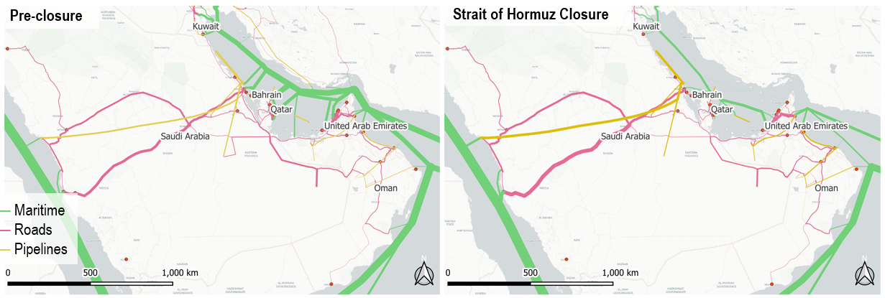
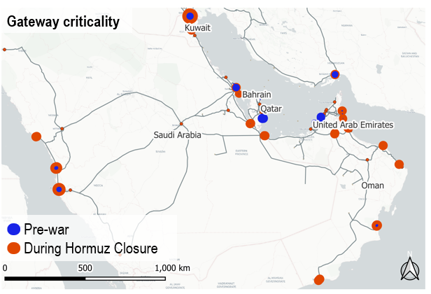
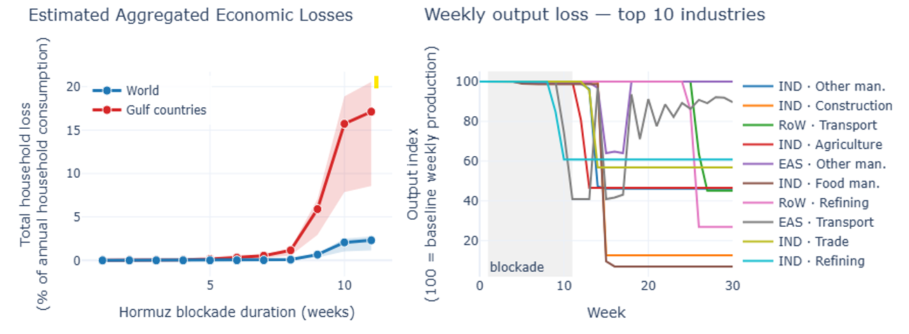

# Strait of Hormuz Closure Beyond Oil

## Logistics Disruption & Supply-Chain Spillovers

*[Célian Colon](mailto:celian.colon@polytechnique.org), International Institute for Applied Systems Analysis (IIASA) — updated 21 April 2026*

!!! note "Brief 1 of the [Hormuz Crisis Tracker](index.md)"
    This is the model-based brief. The empirical companion ([Brief 2](case-studies.md), 29 April) documents five concrete supply-chain cascades now unfolding worldwide.

!!! warning "Preliminary research"
    This brief is based on ongoing research that has **not** yet been peer-reviewed. It presents preliminary analytical insights rather than final published results. Critical feedback is welcome.

[:material-file-pdf-box: **Download full brief (PDF)**](assets/CC_Hormuz_SupplyChains.pdf){ .md-button .md-button--primary }

---

## Key findings

- Beyond oil prices, a Hormuz closure is fundamentally a **logistics shock** affecting multiple supply chains — notably Gulf food and manufactured imports, Indian oil-and-gas-dependent manufacturing, and African fertiliser supply.
- Macroeconomic losses are **highly nonlinear**. Inventories largely absorb the first ~8 weeks; after that, losses accelerate sharply.
- An 11-week closure produces cumulative consumption losses of **~2–3% globally and ~17% in the Gulf** over the following year — but only **~10% of these losses accrue during the closure itself**. The remaining 90% occurs afterwards, as initial shortages cascade and supply chains struggle to recover. Estimates exclude oil-price effects and assume low substitutability and conservative policy response.
- **India and neighbouring South Asian countries** are the first major non-Gulf economies to transmit spillovers, primarily through gas-dependent manufacturing.
- **Reopening the Strait does not end the shock.** Supply-chain disturbances persist for months as inventories rebuild and demand readjusts in an uncoordinated manner.
- **Coordinated industry response** and active resourcing during the closure window can substantially reduce total losses.

---

## Introduction

Most assessments of a Strait of Hormuz closure focus on oil prices. This brief instead examines the logistics and supply-chain channel: how the physical rerouting of trade through a narrower set of ports, pipelines, and land corridors generates its own macroeconomic shock, independent of oil-price effects. Our approach brings logistics, supply chains, and macroeconomic propagation into a single framework, making it possible to trace which flows are blocked, which can be rerouted, who gets hit first, and when a local disruption becomes a wider economic shock.

The chain of effects is the following: alternative routes have limited spare capacity, so closure translates into higher transport costs, delayed or canceled deliveries, and downstream pressure along production chains, especially for oil, gas, and other critical intermediate inputs. The model captures this propagation from logistics constraints through to household consumption losses.

## Logistics and supply chains

The Strait of Hormuz is the maritime gateway to the Gulf for all major cargo classes, including trade serving Iraq and Iran. A first distinction is geographic:

- **Bahrain, Kuwait, and Qatar** are fully dependent on Hormuz for seaborne access. Even with functioning production infrastructure, Qatar's LNG exports are fully blocked by the closure.
- **Saudi Arabia and the UAE** have alternatives on the open-sea side and bypass infrastructure, notably the Saudi East–West pipeline (~5 mbpd nominal) and the UAE's ADCOP to Fujairah (~1.5 mbpd). But rerouting is constrained by operational ramp-up and limited spare capacity.

*Freight flow maps for the Gulf region before the disruption (left) and immediately after closure of the Strait of Hormuz (right). Line thickness reflects the model's estimated monetary value of flow. Source: model estimates.*

Beyond oil and gas, about **40% of vessel traffic through Hormuz consists of container and bulk carriers (25% in tonnage)**. Those flows can, in principle, shift toward Arabian Sea-facing UAE ports such as Fujairah and Khor Fakkan, Omani ports such as Sohar, and Saudi Red Sea gateways. The geographic asymmetry matters: the UAE's main container terminals (Jebel Ali, Khalifa) are located inside the Gulf and are cut off by the closure, while Saudi Arabia retains container access through its Red Sea ports. In practice, rerouting creates new bottlenecks at ports, border crossings, and land bridges. The problem is therefore less the absence of alternatives than the scarcity of spare capacity across them.

*A criticality analysis — asking "if one gateway fails, which hurts most?" — helps uncover these bottlenecks. Under normal conditions, the most critical nodes are those directly tied to Hormuz. Once the strait is disrupted, criticality shifts toward substitute ports and border crossings. Each point is a single port or border crossing, simulated closing it for five weeks, once assuming Hormuz is also closed (red) and once assuming Hormuz is open (blue). Point size shows the economic cost. Source: model estimates.*

## Prices

The inflation picture is not simple or uniform. In Gulf economies whose food and manufactured imports depend heavily on the container terminals inside the Strait, higher transport costs feed directly into local prices. Those countries import **80–90% of their food**, and the bulk of that volume used to transit inner-Gulf container terminals; strategic reserves are being drawn down for grains and edible oils, but most categories require expensive rerouting. Inventories and stockholding soften shortages, but they do not eliminate this price effect. Elsewhere, inflationary pressures are dominated by oil prices, which respond primarily to supply–demand expectations rather than to transport costs. Oil-price dynamics are outside our modelling scope.

## Cascade timeline

| Phase | Duration | What happens |
|---|---|---|
| Phase 1 | Weeks 0–4 | Inventory buffer absorbs shock |
| Phase 2 | Weeks 5–7 | First spillovers (Southern Asia) |
| Phase 3 | Weeks 8–10 | First inventory-exhaustion threshold |
| Phase 4 | Weeks 11+ | Broad supply-chain disturbances |

*Cascade timeline of an 11-week Hormuz closure (model results).*

## Macroeconomic impacts

Beyond consumer prices, the larger macroeconomic hit comes from production disruptions and demand shrinkages. Firms unable to source intermediate inputs scale back output, which propagates upstream (less demand) and downstream (lower output).

Losses are **strongly nonlinear** with respect to closure duration. Inventories partly absorb the first weeks, so macroeconomic effects remain limited even when logistics are badly disrupted. But after roughly two months, the system crosses a threshold: input stocks begin to run out, some production needs to be halted, and one disrupted sector begins to pull others down with it. The damage then accelerates as firms exhaust their buffers and struggle to coordinate. In the model, this inventory-exhaustion threshold appears around weeks 8 to 10.

With an 11-week closure, the model estimates a dramatic loss for the Gulf region over a full year, amounting to **17% of annual household consumption** in the baseline scenario, driven by lost export income and shortages of imported goods. For the world, the estimate is **2–3% of annual consumption**, conditional on the low input substitutability assumed in the model.

Strikingly, **only about 10% of these losses accrue during the 11-week closure itself; the remaining 90% occur in the subsequent recovery period**, as depleted inventories and delayed adjustments continue to drag on output for months after the Strait reopens. Inventories buy time during the closure, but once that time is exhausted, a regional logistics shock becomes a broader shortage cascade — and **reopening does not stop it**.

*Estimated household welfare losses across blockade durations (left) and weekly output trajectories of the ten most-affected industries under an 11-week blockade (right). Left: aggregate loss as share of annual household consumption, Gulf (red) vs. world (blue), with an uncertainty band to be refined via sensitivity analysis. Right: production indexed to pre-disruption baseline (100); grey band marks the blockade window. Source: model estimates.*

## Cascading impacts

One of the first major spillovers outside the Gulf appears in **India**, ahead of many other regions, because of limited oil and gas buffers. Alternative crude sourcing can partly reduce exposure, but gas-dependent industries are harder to protect.

From there, the shock propagates into other manufacturing sectors in India and later to the rest of Asia and beyond. Between weeks 8 and 11, inventories become significantly depleted across Asia, triggering broader losses in manufacturing and transport worldwide. In the model, these losses persist well after the Strait reopens, as depleted inventories and delayed adjustments continue to propagate through supply chains.

**Early warning signs to watch** include fertiliser cost movements worldwide, output adjustments in South Asian fertiliser, petrochemicals, metals, textiles, and ceramics, and the first cross-regional cascades beyond Asia.

!!! info "What we are now seeing in the trade press"
    The empirical companion ([Brief 2](case-studies.md), 29 April) documents how these predicted cascades are starting to materialise — gas in Bangladeshi industrial zones, naphtha in Korean petrochemistry, sulfuric acid in Chilean copper mines, and more.

## Alternative scenarios

The baseline estimates rest on three conservative choices: no coordinated strategic stock releases, no accelerated buildout of alternative corridors, and low input substitutability. Each would soften the headline numbers.

A coordinated release from the U.S. Strategic Petroleum Reserve (~370 million barrels), Chinese and Indian state reserves, and OPEC+ spare capacity could cover several weeks of blocked Gulf crude exports, delaying cascades into manufacturing. Gulf food strategic reserves similarly push the weeks 8–10 threshold out further for essential goods. And historical events suggest that port capacity reallocation proceeds faster than pure capacity-constraint models imply, though always at a cost. These channels would lower but not eliminate the losses modelled here.

## Implications

- The closure of the Strait of Hormuz is **not only a maritime or energy-security issue**. It is a resilience issue across trade, logistics, and supply chains.
- **Timing matters**: inventories and stockholding can soften the first weeks of disruption, but their value declines sharply as buffers erode.
- **Managing shortages and recovery after re-opening is critical.** Most supply-chain disturbances are expected to outlive the closure, such that the bulk of the losses would actually occur during the recovery period. Coordinated resourcing and joint industry agreements on input allocation are essential to reduce economic losses.
- The results underline **the value of alternative corridors** and spare logistics capacity — including Fujairah, the Saudi East–West route, Omani gateways, Saudi Red Sea gateways, and cross-border land links. Preliminary assessment indicates the Fujairah bypass delivers the highest return for the Gulf.
- More broadly, the lesson is not only to diversify sources of supply but also to **avoid excessive concentration of critical imports or exports** through a single narrow chokepoint.

## Model and data

Results are generated using [DisruptSC](https://disrupt-sc.io), a spatial agent-based supply-chain model. The model is detailed for the 7 Gulf economies (ARE, SAU, QAT, KWT, BHR, OMN, IRQ), with the rest of the world aggregated into 8 trade blocs. The transport network combines maritime routes, roads, railways, airways, and oil/gas pipelines, with throughput capacities for 32 Gulf ports and 7 border crossings compiled from public sources. Input–output structure is taken from the GLORIA Multi-Regional Input–Output tables (MRIO, 2023 reference year), a global dataset that tracks how industries in each country supply inputs to industries in every other country. Three cargo types are modelled: containers, dry bulk, and liquid bulk (oil and gas). The model assigns shipments to routes to minimise total delivered cost, subject to each route's physical capacity. Model resolution: 456 firms, 46 households, 15 regions, 19 sectors.

## Limitations

Like any model, these results depend on both data and behavioural assumptions. The main uncertainties concern stocks, inventories, spare logistics capacity, the extent to which higher transport costs are absorbed or passed on, and the speed at which supply can be rerouted or diversified. Important measures are not modelled: strategic petroleum or food stock releases, emergency rerouting capacities, and government-led planned rationing. The analysis should therefore be read less as a precise forecast than as a means of identifying the main mechanisms, bottlenecks, and thresholds.

---

## For media and policy

I am available for interviews, background briefings, and policy consultations on the supply-chain dimensions of the Hormuz crisis. Please contact me at [celian.colon@polytechnique.org](mailto:celian.colon@polytechnique.org).
