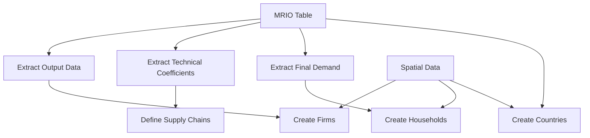
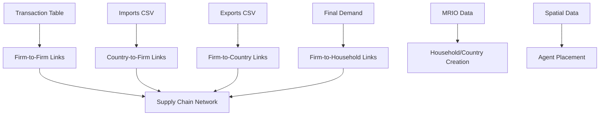
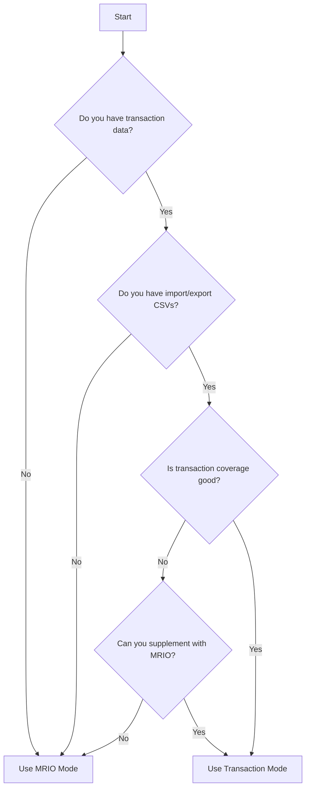

# Data Modes

DisruptSC supports two data input modes for creating economic agents and supply chains. This guide explains when and how to use each mode.

## Overview

| Mode | Data Source | Use Case | Complexity |
|------|-------------|----------|------------|
| **MRIO** | Input-Output tables | Regional/national studies | Simple |
| **Transaction Mode** | Transaction data + Import/Export CSVs | Supply chain studies | Advanced |

## MRIO Mode (Default)

Multi-Regional Input-Output (MRIO) mode uses standard economic accounts data to generate agents and supply chains.

### Configuration

```yaml
# Default - can be omitted
firm_data_type: "mrio"
```

### Data Requirements

#### Required Files
```
data/<scope>/
├── Economic/
│   ├── mrio.csv            # Multi-regional input-output table
│   └── sector_table.csv    # Sector definitions and parameters
└── Spatial/
    ├── households.geojson  # Household spatial distribution
    ├── countries.geojson   # Country/import entry points
    └── firms.geojson       # Firm spatial disaggregation
```

#### MRIO Table Structure

The `mrio.csv` file contains input-output flows:

```csv
region_sector,AGR_Region1,MAN_Region1,SER_Region1,HH_Region1,Export_CHN,...
AGR_Region1,150.5,75.2,25.0,500.0,100.0,...
MAN_Region1,50.0,200.0,150.0,800.0,150.0,...
SER_Region1,25.0,100.0,300.0,600.0,50.0,...
Import_CHN,10.0,50.0,20.0,100.0,0.0,...
...
```

**Key features:**
- Rows = selling sectors, Columns = buying sectors
- Final demand columns (households, exports)
- Import rows for international trade
- Monetary values in consistent units

#### Sector Table Structure

The `sector_table.csv` defines sector characteristics:

```csv
sector,type,output,final_demand,usd_per_ton,share_exporting_firms,supply_data,cutoff
AGR_Region1,agriculture,2000000,500000,950,0.16,ag_prod,3500000
MAN_Region1,manufacturing,5000000,800000,2864,0.45,man_prod,5000000
SER_Region1,service,3000000,600000,0,0.10,ser_emp,2000000
```

**Required columns:**
- `sector` - Region_sector identifier
- `type` - Sector category (agriculture, manufacturing, etc.)
- `output` - Total yearly output (model currency)
- `final_demand` - Total yearly final demand
- `usd_per_ton` - USD value per ton (0 for services)
- `share_exporting_firms` - Fraction of firms that export
- `supply_data` - Spatial disaggregation attribute
- `cutoff` - Minimum threshold for firm creation

### How MRIO Mode Works



#### 1. Firm Creation
- **One firm per region-sector** with non-zero output
- **Spatial disaggregation** based on `firms.geojson` attributes
- **Production capacity** from MRIO output data
- **Input requirements** from technical coefficients

#### 2. Household Creation  
- **Spatial distribution** from `households.geojson`
- **Consumption patterns** from MRIO final demand
- **Population weighting** for disaggregation

#### 3. Country Creation
- **Trade partners** from MRIO import/export data  
- **Entry points** from `countries.geojson`
- **Trade volumes** from international flows

#### 4. Supply Chain Formation
- **Technical coefficients** define input requirements
- **Supplier selection** based on spatial proximity and importance
- **Import/export links** for international trade

### Advantages

✅ **Comprehensive coverage** - All economic sectors included
✅ **Data availability** - Standard economic accounts exist globally  
✅ **Consistent framework** - Based on economic theory
✅ **Regional detail** - Sub-national disaggregation possible
✅ **Simple setup** - Minimal data requirements

### Limitations

❌ **Aggregated view** - Less firm-level detail
❌ **Synthetic supply chains** - Generated, not observed
❌ **Homogeneous firms** - Single firm per region-sector
❌ **Static relationships** - No firm dynamics

### Best Use Cases

- **Regional impact analysis** - Natural disasters, trade shocks
- **Policy evaluation** - Infrastructure investments, regulations
- **Academic research** - Theoretical model applications
- **Baseline studies** - Understanding economic structure

## Transaction Mode

Transaction mode uses observed transaction data combined with import/export flows to create explicit supply chain networks based on real economic relationships.

### Configuration

```yaml
firm_data_type: "transaction_based"
```

### Data Requirements

```
data/<scope>/
├── Economic/
│   ├── transaction_table.csv  # Firm-to-firm transactions
│   ├── imports.csv           # Import flows by country/sector
│   ├── exports.csv           # Export flows by country/sector
│   ├── final_demand.csv      # Household consumption patterns
│   └── mrio.csv             # Still required for baseline data
└── Spatial/
    ├── firms.geojson         # Firm spatial data
    ├── households.geojson    # Household spatial data
    └── countries.geojson     # Country entry points
```

#### Transaction Table Structure

```csv
buyer_firm_id,seller_firm_id,transaction_value,import_value,export_value
0,1,200.0,0,0
0,2,100.0,0,0
1,3,200.0,0,0
2,4,150.0,0,0
```

#### Import/Export CSV Structure

Multi-header format with countries and metrics:

**imports.csv:**
```csv
,,USA,USA,COL,COL,PER,PER
region,sector,imports,usd_per_ton,imports,usd_per_ton,imports,usd_per_ton
ECU,A0116,80,1000,40,1000,0,0
ECU,A0161,60,1200,0,0,60,1200
```

**exports.csv:**
```csv
,,USA,COL,PER
region,sector,exports,imports,imports
ECU,A0116,100,40,0
ECU,A0161,120,0,60
```

### How Transaction Mode Works



#### Network Building Pipeline

**1. Firm-to-Firm Relationships**
- **Direct from transaction table** - No algorithmic selection
- **Observed transaction values** - Real economic flows
- **Predefined supplier-buyer pairs** - Based on actual data

**2. Country-to-Firm Relationships**
- **Import relationships** derived from firm input mix analysis
- **Countries supply imports** to firms based on input requirements
- **Trade flows** from imports CSV with multi-header structure

**3. Firm-to-Household Relationships**
- **Household supplier selection** similar to MRIO mode
- **Final demand patterns** from final_demand.csv
- **Spatial distribution** from households.geojson

**4. Firm-to-Country Relationships**
- **Export relationships** with 10% firm selection per sector
- **Countries select suppliers** from domestic firms
- **Export volumes** from exports CSV

### Calibration Approach

**Direct Relationships:**
- **Transaction values** directly from observed data
- **No technical coefficients** - uses actual transaction amounts
- **Firm input mix** calculated from transaction history

**Country Selection Rules:**
- **10% export selection rule** - Countries select ~10% of firms per sector as suppliers
- **Import coefficients** derived from firm input requirements
- **Trade volumes** explicitly specified in CSV files

**Household Patterns:**
- **Final demand** from MRIO data (consistent with MRIO mode)
- **Spatial disaggregation** maintains MRIO compatibility

### Advantages

✅ **Observed relationships** - Based on real transaction data
✅ **No algorithmic bias** - Direct supplier-buyer connections
✅ **Flexible trade data** - Custom import/export specifications
✅ **MRIO compatibility** - Households/countries use same spatial data
✅ **Calibration control** - Direct control over trade relationships

### Limitations

❌ **Data requirements** - Needs detailed transaction records
❌ **Limited scope** - Typically covers only domestic B2B flows
❌ **Static relationships** - Based on historical transaction patterns
❌ **Coverage gaps** - May miss informal or new relationships

### Best Use Cases

- **Supply chain resilience** - Critical supplier identification
- **Firm-level analysis** - Individual company impacts  
- **Network studies** - Supply chain structure analysis
- **Policy targeting** - Firm-specific interventions

## Mode Comparison

### Data Requirements

| Aspect | MRIO Mode | Transaction Mode |
|--------|-----------|------------------|
| **Setup complexity** | Simple | Moderate |
| **Data availability** | High | Medium |
| **Data sensitivity** | Low | Medium |
| **Preprocessing** | Minimal | Moderate |

### Model Characteristics

| Aspect | MRIO Mode | Transaction Mode |
|--------|-----------|------------------|
| **Firm representation** | Aggregate | Individual |
| **Supply chains** | Generated | Observed |
| **Relationships** | Algorithmic | Direct |
| **Trade flows** | Computed | Specified |

### Computational Performance

| Aspect | MRIO Mode | Transaction Mode |
|--------|-----------|------------------|
| **Model size** | Smaller | Similar |
| **Memory usage** | Lower | Similar |
| **Runtime** | Faster | Similar |
| **Scalability** | Better | Good |

## Choosing the Right Mode

### Decision Framework



### Use MRIO Mode When:

- **Standard analysis** - Regional impact assessment
- **Data constraints** - Limited access to firm data
- **Academic research** - Theoretical model applications
- **Policy analysis** - Broad economic impacts
- **Initial exploration** - Understanding system structure

### Use Transaction Mode When:

- **Observed relationships** - Want to use actual transaction data
- **Custom trade flows** - Need control over import/export specifications
- **Supply chain validation** - Match known supplier-buyer relationships
- **Transaction-based studies** - Focus on real economic flows
- **Hybrid approach** - Combine observed and generated relationships

## Migration Between Modes

### From MRIO to Transaction Mode

If you start with MRIO and later obtain transaction data:

1. **Keep MRIO files** - Still needed for households/countries
2. **Prepare transaction files** - Create transaction_table.csv, imports.csv, exports.csv
3. **Update configuration** - Change `firm_data_type` to `"transaction_based"`
4. **Test network building** - Verify all relationships are created correctly

### From Transaction Mode to MRIO

If transaction data becomes unavailable:

1. **Keep MRIO files** - Switch back to algorithmic generation
2. **Update configuration** - Change `firm_data_type` to `"mrio"` or remove parameter
3. **Expect differences** - Supply chains will be generated rather than observed
4. **Validate consistency** - Check aggregate matches

### From Network to MRIO

If network data becomes unavailable:

1. **Aggregate firm data** - Create MRIO equivalent
2. **Remove firm tables** - Keep only aggregated data
3. **Update configuration** - Revert to MRIO mode
4. **Verify results** - Compare with network version

## Validation and Quality Checks

### MRIO Mode Validation

```bash
# Check MRIO balance
python validate_inputs.py Cambodia --check-mrio-balance

# Verify sector consistency  
python validate_inputs.py Cambodia --check-sectors

# Spatial consistency
python validate_inputs.py Cambodia --check-spatial
```

### Network Mode Validation

```bash
# Firm data consistency
python validate_inputs.py Cambodia --check-firms

# Transaction completeness
python validate_inputs.py Cambodia --check-transactions

# Network connectivity
python validate_inputs.py Cambodia --check-network
```

### Cross-Mode Comparison

```python
# Compare aggregate results
from disruptsc.validation import compare_modes

results = compare_modes(
    mrio_results='output/Cambodia_mrio/',
    network_results='output/Cambodia_network/'
)
print(results.summary())
```

## Best Practices

### Data Preparation

1. **Start with validation** - Always validate before simulation
2. **Check aggregation** - Ensure consistency between levels
3. **Document sources** - Track data provenance
4. **Version control** - Manage data updates

### Model Development

1. **Begin with MRIO** - Start simple, add complexity
2. **Validate incrementally** - Test each data addition
3. **Compare modes** - Cross-validate when possible
4. **Document assumptions** - Record modeling choices

### Production Use

1. **Choose appropriate mode** - Match to research question
2. **Validate results** - Check against known benchmarks
3. **Sensitivity analysis** - Test parameter variations
4. **Archive configurations** - Preserve reproducibility